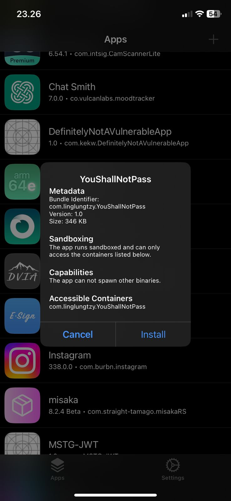
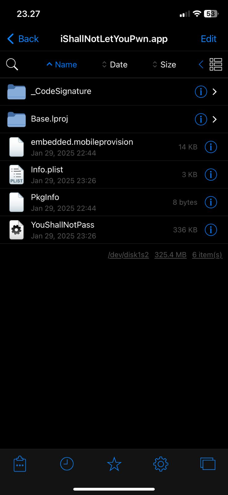
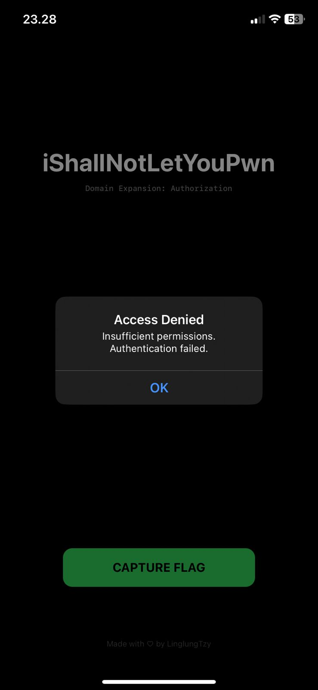
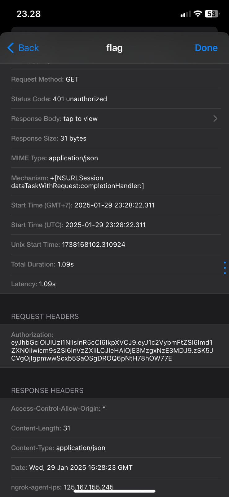
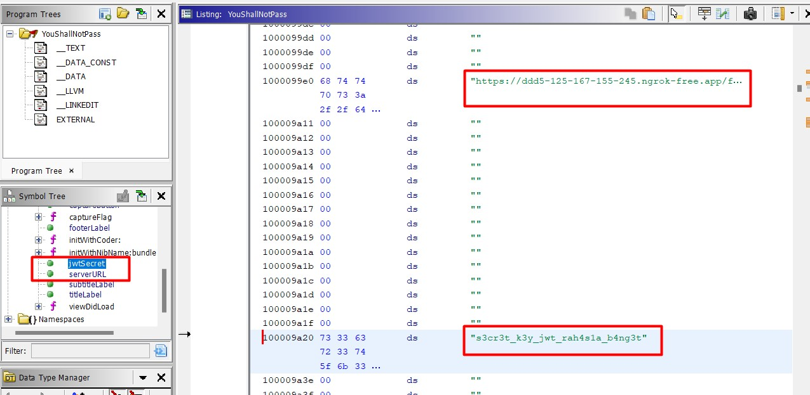
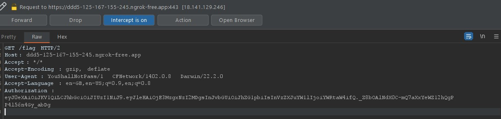
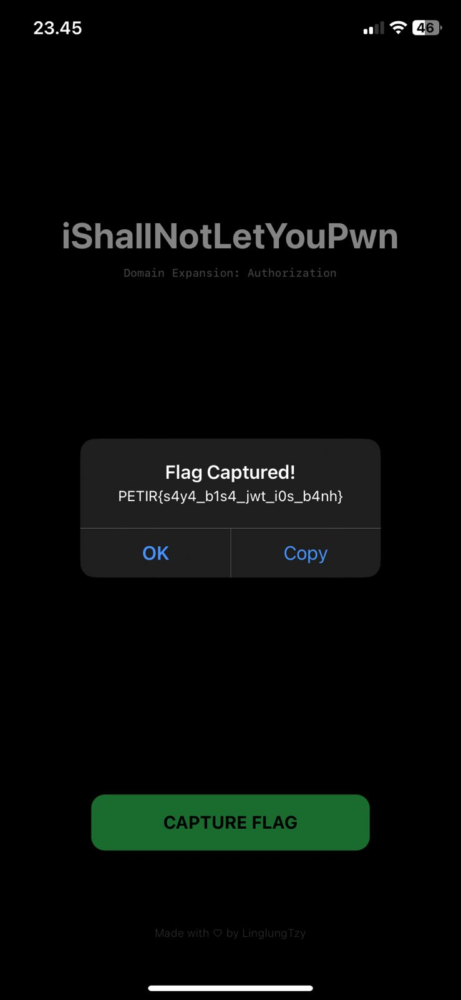

# iShallNotLetYouPwn Challenge Walkthrough

## 1. **Initial Reconnaissance**

- **Sideload Application into iOS device**: Via TrollStore, AltStore, and other sideloading services
  
- **Locate & Retrieve Application Binary Executable**: `"/private/var/containers/Bundle/Application/[unique-identifier]/[app].app/[binary]"`
  
- **Bypass Jailbreak Detection Using Tools Such as Shadow**
- **Inspect Application & Network Behavior**
  
  

---

## 2. **Static Code Analysis**

Upon decompiling the binary, you will uncover critical vulnerabilities:

### **Key Findings**:

- **Hardcoded JWT Secret**
- **Server URL**


---

## 3. **Exploitation Strategy**

The vulnerability stems from predictable token generation due to:

- The **secret key** being hardcoded.

---

## 4. **Token Forging**

To capture the flag, follow these steps:

1. **Create a token** with the `"admin"` role.
2. **Use the hardcoded secret key** to sign the token.
3. **Send the forged token** in the Authorization header.

### **Forged Token Payload Example**:

```json
{
    "username": "admin",
    "role": "admin",
    "exp": [current timestamp + 3600]
}
```

---

## 5. **Network Interception**

Use a network proxy (e.g., **Burp Suite**) to intercept the GET request to `/flag`. Replace the `Authorization` header with the forged token.

---

## 6. **Flag Retrieval**

Successfully sending the forged admin token will return the hidden flag.

